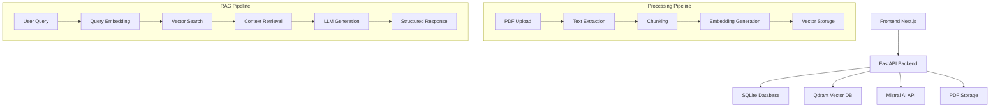

# 🤖 AI RAG PDF - Assistant Intelligent pour Documents

Une application complète de chat IA avec recherche vectorielle sur documents PDF, utilisant les technologies les plus avancées pour fournir des réponses précises et sourcées.


## 🌟 Fonctionnalités

### 💬 Chat Intelligent
- **IA Conversationnelle** : Modèle Mistral pour des réponses naturelles et précises
- **Recherche Sémantique** : Technologie Qdrant pour une compréhension contextuelle
- **Citations Automatiques** : Sources précises avec extraits du contenu
- **Interface Moderne** : Chat en temps réel avec animations et feedback

### 📄 Gestion de Documents
- **Upload PDF** : Drag & drop avec validation et prévisualisation
- **Ingestion Intelligente** : Chunking optimisé et création d'embeddings
- **Bibliothèque** : Gestion complète de vos documents
- **Métadonnées** : Suivi automatique des informations (taille, pages, date)

### 🔍 Recherche Avancée
- **Vectorisation** : Sentence Transformers pour l'encodage sémantique
- **Base Vectorielle** : Qdrant pour des performances optimales
- **Top-K Retrieval** : Récupération des passages les plus pertinents
- **Score de Similarité** : Transparence sur la pertinence des sources

## 🏗️ Architecture



### Backend (FastAPI + Python)
```
backend/
├── app/
│   ├── main.py              # Configuration FastAPI et routes principales
│   ├── core/                # Configuration et utilitaires centraux
│   │   ├── config.py        # Gestion des variables d'environnement
│   │   └── qdrant.py        # Configuration base vectorielle
│   ├── models/              # Modèles de données SQLModel
│   │   ├── base.py          # Configuration base de données
│   │   ├── document.py      # Modèle Document
│   │   └── chat.py          # Modèle Chat/Session
│   ├── services/            # Logique métier
│   │   ├── storage.py       # Gestion fichiers PDF
│   │   ├── embeddings.py    # Génération embeddings
│   │   ├── vectorstore.py   # Interface Qdrant
│   │   └── rag.py          # Pipeline RAG complet
│   ├── routers/             # Endpoints API REST
│   │   ├── documents.py     # CRUD documents
│   │   ├── chat.py         # Chat et historique
│   │   └── health.py       # Monitoring
│   └── workers/             # Tâches asynchrones
│       └── ingest_worker.py # Ingestion PDF en arrière-plan
└── storage/                 # Stockage persistant des PDFs
```

### Frontend (Next.js + TypeScript)
```
frontend/
├── src/
│   ├── app/                 # App Router Next.js 15
│   │   ├── layout.tsx       # Layout global avec navbar
│   │   ├── page.tsx         # Page chat principale
│   │   └── library/         # Page gestion documents
│   ├── components/          # Composants React réutilisables
│   │   ├── ChatPanel.tsx    # Interface chat complète
│   │   ├── MessageList.tsx  # Affichage messages avec animations
│   │   ├── SourceChips.tsx  # Composant sources/citations
│   │   ├── MarkdownContent.tsx # Rendu Markdown avec syntaxe
│   │   ├── DragDropUploader.tsx # Upload avec drag & drop
│   │   └── PdfList.tsx      # Liste documents avec actions
│   ├── lib/                 # Utilitaires et API client
│   │   └── api.ts           # Client HTTP avec retry et cache
│   └── styles/              # Styles Tailwind CSS
├── public/                  # Assets statiques
└── next.config.js           # Configuration Next.js
```

## 🚀 Installation et Démarrage

### Prérequis
- **Python 3.12+**
- **Node.js 18+** et npm/yarn
- **Docker** (optionnel pour Qdrant)

### 1. Configuration de l'environnement

```bash
# Cloner le projet
git clone <repository-url>
cd ai-rag-pdf
```

### 2. Backend Setup

```bash
cd backend

# Créer un environnement virtuel
python -m venv .venv
source .venv/bin/activate  # Linux/Mac
# .venv\Scripts\activate   # Windows

# Installer les dépendances
pip install -r requirements.txt
# ou avec pyproject.toml
pip install -e .

# Configuration environnement
cp .env.example .env
# Éditer .env avec vos paramètres
```

**Configuration `.env` :**
```env
# API Configuration
API_PREFIX=/api

# Mistral AI
MISTRAL_API_KEY=your_mistral_api_key_here
MISTRAL_MODEL=mistral-small-latest

# Qdrant Vector Database
QDRANT_URL=http://localhost:6333
QDRANT_COLLECTION=docs_rag

# SQLite Database
DB_URL=sqlite:///./rag.db

# Storage
STORAGE_DIR=./storage

# RAG Parameters
CHUNK_SIZE=800
CHUNK_OVERLAP=150
TOP_K=5
TEMPERATURE=0.2
```

### 3. Qdrant Setup

**Option A - Docker (Recommandé):**
```bash
docker run -p 6333:6333 qdrant/qdrant
```

**Option B - Installation locale:**
```bash
# Suivre les instructions sur https://qdrant.tech/documentation/quick-start/
```

### 4. Frontend Setup

```bash
cd frontend

# Installer les dépendances
npm install

# Configuration environnement
cp .env.example .env.local
# Éditer .env.local
```

**Configuration `.env.local` :**
```env
NEXT_PUBLIC_API_BASE=http://localhost:8000/api
```

### 5. Démarrage des Services

**Terminal 1 - Backend:**
```bash
cd backend
source .venv/bin/activate
uvicorn app.main:app --reload --host 0.0.0.0 --port 8000
```

**Terminal 2 - Frontend:**
```bash
cd frontend
npm run dev
```

**Accès à l'application :**
- 🌐 **Frontend** : http://localhost:3000
- 🔧 **API Backend** : http://localhost:8000
- 📚 **Documentation API** : http://localhost:8000/docs
- 🗄️ **Qdrant Dashboard** : http://localhost:6333/dashboard

## 🔧 Technologies Utilisées

### Backend Stack
- **[FastAPI](https://fastapi.tiangolo.com/)** - Framework web moderne et rapide
- **[SQLModel](https://sqlmodel.tiangolo.com/)** - ORM typé avec Pydantic
- **[Qdrant](https://qdrant.tech/)** - Base de données vectorielle haute performance
- **[Sentence Transformers](https://sentence-transformers.readthedocs.io/)** - Modèles d'embeddings pré-entraînés
- **[PyPDF](https://pypdf.readthedocs.io/)** - Extraction de texte PDF
- **[Mistral AI](https://docs.mistral.ai/)** - Modèles de langage avancés

### Frontend Stack
- **[Next.js 15](https://nextjs.org/)** - Framework React avec App Router
- **[TypeScript](https://typescriptlang.org/)** - Typage statique
- **[Tailwind CSS](https://tailwindcss.com/)** - Framework CSS utilitaire
- **[Lucide React](https://lucide.dev/)** - Icônes modernes
- **[React Markdown](https://github.com/remarkjs/react-markdown)** - Rendu Markdown